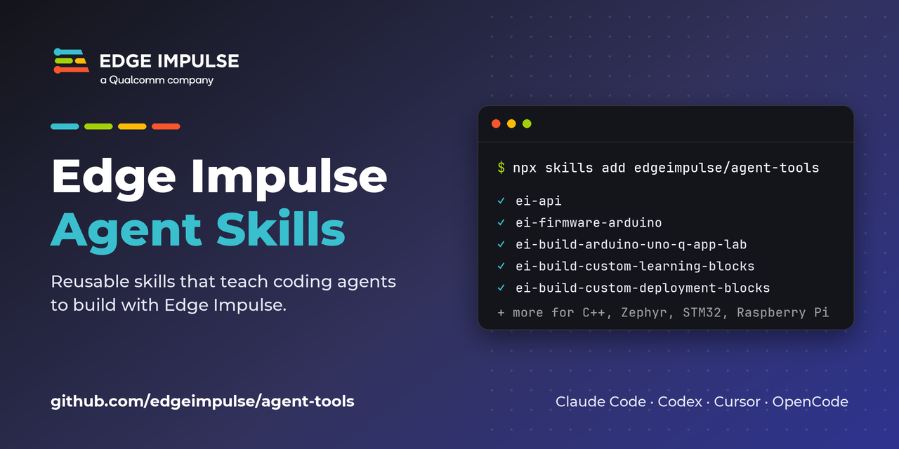

<p align="center">
  
</p>

<h1 align="center">Edge Impulse Agent Skills</h1>

<p align="center">
  Teach your coding agent to build edge AI with Edge Impulse.
</p>

<p align="center">
  <a href="https://skills.sh/edgeimpulse/agent-tools"></a>
  <a href="https://agentskills.io/specification"></a>
  <a href="https://github.com/edgeimpulse/agent-tools/actions/workflows/validate-skills.yml"></a>
</p>

<p align="center">
  <a href="#quick-start">Quick start</a> ·
  <a href="#available-skills">Skills</a> ·
  <a href="#installation">Installation</a> ·
  <a href="#contributing">Contributing</a> ·
  <a href="https://docs.edgeimpulse.com">Edge Impulse docs</a>
</p>

---

Agent Skills are folders of instructions, scripts, and references that coding agents load when a task needs them. The skills in this repository give agents such as Claude Code, Codex, Cursor, and OpenCode the know-how to work with Edge Impulse: the Studio and Ingestion APIs, firmware for Arduino, STM32, Zephyr, and Raspberry Pi, and custom blocks.

Every skill follows the [Agent Skills specification](https://agentskills.io/specification), and every skill name starts with `ei-` so it's easy to spot next to skills from other catalogs.

## Quick start

Install the whole catalog with the [`skills`](https://www.npmjs.com/package/skills) CLI. You'll need [Node.js](https://nodejs.org) and Git.

```bash
npx skills add edgeimpulse/agent-tools
```

Then ask your agent for something like:

- "Deploy my Edge Impulse model to an Arduino Nano 33 BLE Sense and print the predictions over serial."
- "Write a Python script that uploads every WAV file in this folder to my Edge Impulse project."
- "Run my object detection model on a Raspberry Pi camera feed."
- "Scaffold a custom learning block that trains a PyTorch model."

Your agent picks the right skill from its description and loads it automatically.

## Available skills

Stable skills are ready for everyday use. Experimental skills are newer, may change, and we'd love your feedback on them.

### Platform and APIs

| Skill | Status | What it does |
| --- | --- | --- |
| [`ei-api`](skills/ei-api) | Stable | Edge Impulse Studio, Ingestion, and Remote Management APIs, CLI tools, Linux runners, and SDKs |

### Device firmware

| Skill | Status | What it does |
| --- | --- | --- |
| [`ei-firmware-arduino`](skills/ei-firmware-arduino) | Stable | Arduino sketches that run an exported Edge Impulse library |
| [`ei-firmware-cpp`](skills/.experimental/ei-firmware-cpp) | Experimental | Desktop, Linux, and generic MCU C++ apps that use an exported Edge Impulse library |
| [`ei-firmware-raspberry-pi-python`](skills/.experimental/ei-firmware-raspberry-pi-python) | Experimental | Raspberry Pi and Linux Python inference with EIM models |
| [`ei-firmware-stm32`](skills/.experimental/ei-firmware-stm32) | Experimental | STM32CubeIDE and FreeRTOS C++ inference |
| [`ei-firmware-zephyr`](skills/.experimental/ei-firmware-zephyr) | Experimental | Zephyr and nRF Connect SDK module integration |

### Arduino UNO Q

| Skill | Status | What it does |
| --- | --- | --- |
| [`ei-build-arduino-uno-q-app-lab`](skills/ei-build-arduino-uno-q-app-lab) | Stable | Arduino App Lab apps and bricks, Edge Impulse models, and Flask UIs |
| [`ei-build-arduino-router-rpc`](skills/.experimental/ei-build-arduino-router-rpc) | Experimental | Custom MessagePack RPC clients for the MPU to MCU router |

### Custom blocks

| Skill | Status | What it does |
| --- | --- | --- |
| [`ei-build-custom-learning-blocks`](skills/ei-build-custom-learning-blocks) | Stable | Custom ML training containers |
| [`ei-build-custom-deployment-blocks`](skills/ei-build-custom-deployment-blocks) | Stable | Custom deployment targets |
| [`ei-build-custom-processing-blocks`](skills/.experimental/ei-build-custom-processing-blocks) | Experimental | Custom DSP feature extraction servers |
| [`ei-build-custom-transformation-blocks`](skills/.experimental/ei-build-custom-transformation-blocks) | Experimental | Organization data preprocessing jobs |
| [`ei-build-custom-ai-labeling-blocks`](skills/.experimental/ei-build-custom-ai-labeling-blocks) | Experimental | Automatic labels and bounding boxes, with preview mode |
| [`ei-build-custom-synthetic-data-blocks`](skills/.experimental/ei-build-custom-synthetic-data-blocks) | Experimental | Generate samples and upload them through the Ingestion API |

## Installation

The [`skills`](https://github.com/vercel-labs/skills) CLI from Vercel installs skills for [many coding agents](https://github.com/vercel-labs/skills#supported-agents), including Claude Code, Codex, Cursor, and OpenCode.

```bash
# See what's available without installing anything
npx skills add edgeimpulse/agent-tools --list

# Pick skills and agents interactively
npx skills add edgeimpulse/agent-tools

# Install specific skills by name
npx skills add edgeimpulse/agent-tools --skill ei-api --skill ei-firmware-arduino

# Install the whole catalog to every detected agent, no prompts
npx skills add edgeimpulse/agent-tools --all

# Install the whole catalog, but choose the agents yourself
npx skills add edgeimpulse/agent-tools --skill '*' --agent claude-code --yes
```

Experimental skills appear alongside stable ones in all of these. Use `--agent` to target specific agents and `--yes` to skip the prompts in CI.

<details>
<summary><strong>Project or global scope</strong></summary>

Everything installs into the current project unless you pass `-g`:

| Scope | Flag | Installed to |
| --- | --- | --- |
| Project (default) | none | `./<agent>/skills/` in the current directory |
| Global | `-g`, `--global` | `~/<agent>/skills/` in your home directory |

```bash
npx skills add edgeimpulse/agent-tools --skill ei-api --global --agent claude-code --yes
```

</details>

<details>
<summary><strong>List, update, and remove skills</strong></summary>

```bash
# Show the skills you have installed
npx skills list

# Update installed skills to the latest version in this repository
npx skills update ei-api

# Remove a skill (add --global if you installed it globally)
npx skills remove ei-api
```

Run `npx skills remove` with no arguments to pick from the installed skills interactively.

</details>

<details>
<summary><strong>Try a skill without installing it</strong></summary>

```bash
npx skills use edgeimpulse/agent-tools@ei-api --agent claude-code
```

</details>

<details>
<summary><strong>Upgrading from unprefixed names</strong></summary>

Skills in this catalog were previously published without the `ei-` prefix (`api`, `firmware-arduino`, and so on). `npx skills update` doesn't rename an installed skill, so remove the old copy and install the prefixed one:

```bash
npx skills remove api
npx skills add edgeimpulse/agent-tools --skill ei-api
```

</details>

## How this repository works

### Catalog lifecycle

The lifecycle directories are repository conventions, not Agent Skills frontmatter fields:

| Directory | Lifecycle | What to expect |
| --- | --- | --- |
| `skills/` | Stable | Backwards compatibility is expected. |
| `skills/.experimental/` | Experimental | May change or be removed. Suitable for early adopters and feedback. |
| `skills/.deprecated/` | Deprecated | Kept for existing users. Don't build on these. |

### Skill versions

Each `SKILL.md` stores a semantic version in `metadata.version`. Stable skills start at `1.0.0`, and experimental skills start at `0.1.0`.

After a push to `main`, the version workflow increments the patch version once for every skill with changed files and opens a pull request with those bumps. Changes outside a skill directory don't affect skill versions, and merging a generated version-bump pull request doesn't trigger another bump.

## Contributing

We welcome bug reports, fixes, and new skills.

- **Found a problem?** [Open an issue](https://github.com/edgeimpulse/agent-tools/issues) with the prompt you used and what the agent did.
- **Want to improve a skill or add one?** Open a pull request and follow [CONTRIBUTING.md](CONTRIBUTING.md).

## Resources

- [Edge Impulse documentation](https://docs.edgeimpulse.com)
- [Agent Skills specification](https://agentskills.io/specification)
- [`skills` CLI](https://github.com/vercel-labs/skills)
- [Edge Impulse forum](https://forum.edgeimpulse.com)
